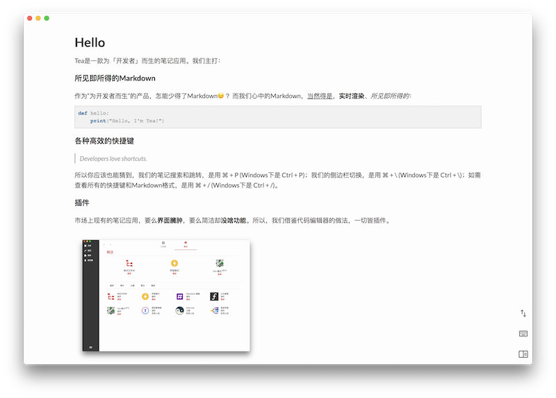

  

  Tea，为开发者而生的笔记应用

  

## 提交反馈
本GitHub仓库用于方便大家提出新功能需求和bug反馈。请在Issues里提交您的想法和改进意见。
同时为了能够更好更快的处理大家的需求，我们希望大家能够在Issues里：
- 使用明确、有意义的标题
- 描述事实（环境、具体版本等）与期待效果
- 尽量多的提供复现场景（推荐使用 http://recordit.co/ 录屏）

## 微信反馈群
我们也欢迎您加入我们的微信反馈群跟我们更及时地沟通：

## 下载使用
请前往Tea的官网：https://www.haocha.co/ 下载最新版Mac或Windows客户端。
